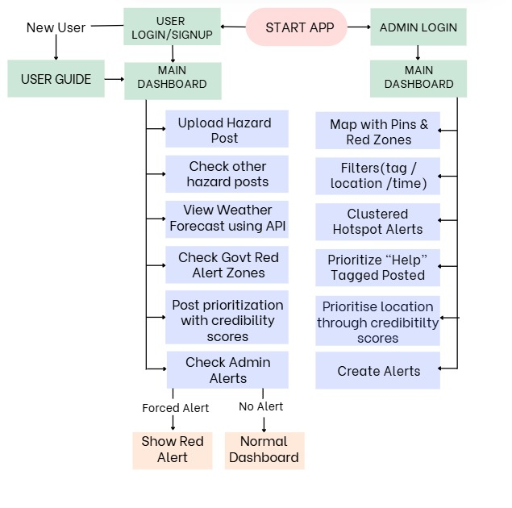
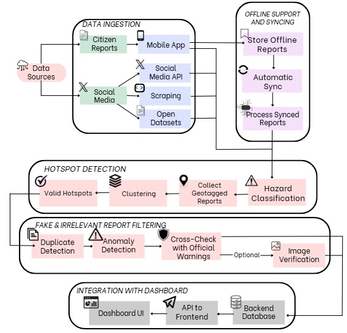

# MarineX – Ocean Hazard Reporting Prototype

**MarineX** is a  platform designed to support **citizen-based ocean hazard reporting** and enhance **situational awareness** for disaster management agencies, complementing early warning services provided by **INCOIS**.

---

## 🌊 About INCOIS

The **Indian National Centre for Ocean Information Services (INCOIS)**, under the Ministry of Earth Sciences, provides ocean information and advisory services to promote **maritime safety** and **disaster risk reduction**. INCOIS delivers early warnings for:

- Tsunamis  
- Storm surges  
- High waves and swell surges  
- Coastal currents  

While INCOIS provides accurate forecasts, **real-time field data from citizens** and **social media insights** are often delayed or underutilized.

---

## 🏝 Background

India’s coastline is vulnerable to multiple ocean hazards. Effective response requires **real-time reporting** and **monitoring public discussions**. Social media and local observations often contain early indicators of hazard events but remain underutilized.

---

## 💡 Problem Statement

There is no unified platform to:

- Allow citizens to report ocean hazards in real-time  
- Aggregate crowd-sourced observations with social media trends  
- Visualize reports dynamically to identify hotspots  
- Provide actionable insights to disaster managers  

---

## 🔧 Proposed Solution

MarineX bridges this gap with an **integrated web + mobile platform** enabling:

### 1️⃣ Citizen Reporting
- Geotagged reports with photos/videos  
- Role-based access (citizens, officials, analysts)  

### 2️⃣ Dynamic Dashboard
- Map-based visualization of live reports  
- Hotspot detection based on report density or verified incidents  

### 3️⃣ Social Media Monitoring
- Integration with Twitter, YouTube, and public posts  
- NLP/Text Classification to extract hazard-related trends and sentiment  

### 4️⃣ Situational Awareness
- Filters by location, event type, date, and source  
- Insights to validate warnings and prioritize response  

### 5️⃣ Technical Features
- Backend database + API for managing crowdsourced data  
- Multilingual support for regional accessibility  
- Offline data collection and later synchronization  

---

## ✅ Features Implemented (Prototype Stage)

- React + TypeScript + Vite project setup  
- TailwindCSS styling  
- Map-based UI with placeholder hazard reports  
- Role-based navigation for citizens and officials  
- Basic dashboard for report visualization  

---

## 🛠 Planned Features

- Social media integration + NLP  
- Dynamic hotspot generation  
- Media upload (photos/videos)  
- Authentication & role-based access  
- Offline reporting & sync  
- Integration with INCOIS early warning system  

---

## 🔀 Workflow / Architecture

### Frontend Flow
  
*Figure 1: Step-by-step flow from user report submission to dashboard visualization.*

### Backend and Ai flow
  
*Figure 2: Integration of social media feeds with crowdsourced hazard reports and hotspot detection.*

---

## 🚀 Getting Started

### 1️⃣ Clone Repository
```bash
git clone https://github.com/Harsh-Kumar-6/MarineX__prototype.git
cd MarineX__prototype
